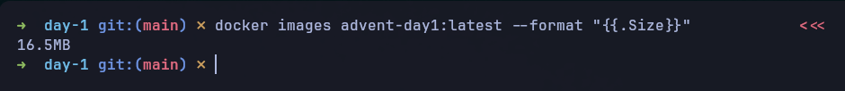
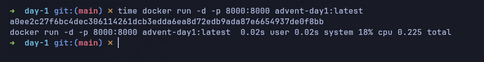
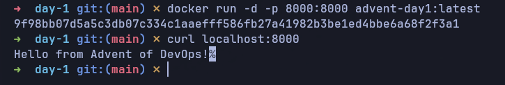

# Day 1: Build a minimal Docker Image

## Description
You're tasked with containerizing a small application, but your manager is concerned about image size and security. Large images slow down deployments, cost more to store, and have larger attack surfaces. Your goal is to create the smallest, most efficient Docker image possible.

### Task
Create the smallest working Docker image you can for the given application code.

### Requirements
- [x] Image must be under 25MB
- [x] Application must run successfully
- [x] Use multi-stage builds
- [x] Use Alpine Linux base images
- [x] Remove unnecessary dependencies
  
### Target
- Image Size: Under 25MB
- Startup Time: Under 2 seconds
- Security: Minimal attack surface with Alpine base

## Verification

1. Build docker image
```sh
docker build -t advent-day1:latest .
```

2. Verify image size
```sh
docker images advent-day1:latest --format "{{.Size}}" # ~16MB
```

3. Verify non-root user
```sh
docker run --rm advent-day1:latest whoami # appuser
```

4. Verify application is working
```sh
docker run -d -p 8000:8000 advent-day1:latest
curl localhost:8000 # Hello from Advent of DevOps!
```

## Screenshots
### Image size


### Startup time


### App running
