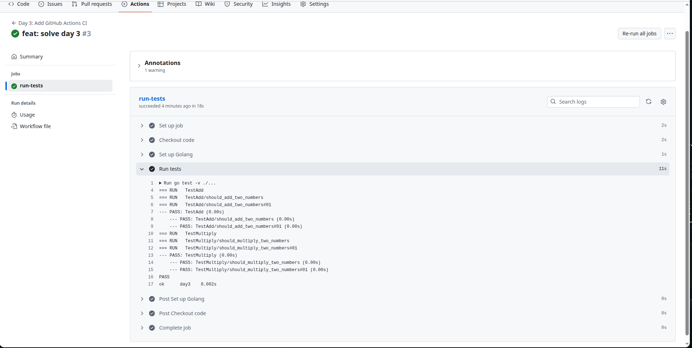

# Day 3: Add GitHub Actions CI

## Description
Your team has been manually testing code before merging pull requests. This is slow, error-prone, and doesn't scale. You need to set up automated testing that runs on every push.

### Task
Add a GitHub Actions workflow that runs tests on every push.

### Requirements:
- [x] Trigger on push and pull request events
- [x] Run tests for the application
- [x] Report test results
- [x] Fail the build if tests fail

### Target
- Workflow runs automatically on push
- All tests execute successfully
- Clear pass/fail status in GitHub UI
- Runs in under 2 minutes

## Verification

1. Make an small change in the code and push code to `day3` branch
2. Look at Github Actions viewer in repo and verify code testing and building

## Screenshots

### Tests success

