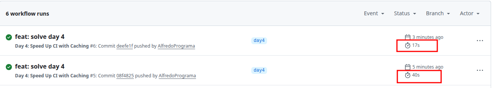

# Day 4: Speed Up CI with Caching

## Description
Your GitHub Actions workflow runs every time, but it's downloading and installing the same dependencies repeatedly. Each run takes 5+ minutes when it could take less than 2 minutes with proper caching.

### Task
- [x] Add caching for dependencies to your GitHub Actions workflow.

### Target
- Time Reduction: 40% or more
- Cache Hit Rate: 80%+ on subsequent runs
- Cache Size: Reasonable (under 500MB)s

## Verification

1. Make small change and push to `day4` branch
2. Verify Github Actions starts workflow
3. First workflow can take long time (because cache is missing and must create new one)
4. Click on re-run jobs in Github Actions dashboard
5. Confirm latest workflow performance improvement 

## Screenshots

### Workflow time improvement comparison

### Cache size (<500 MB)

