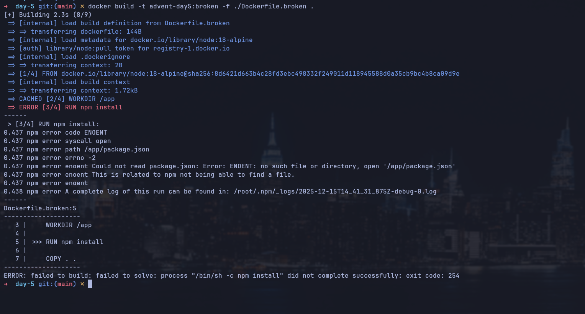
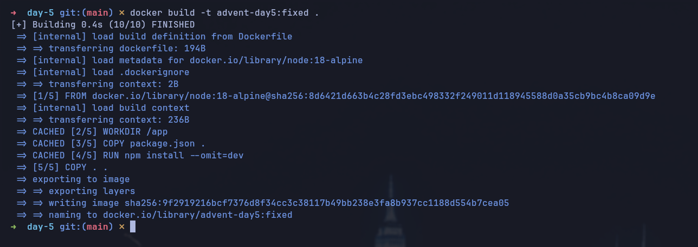
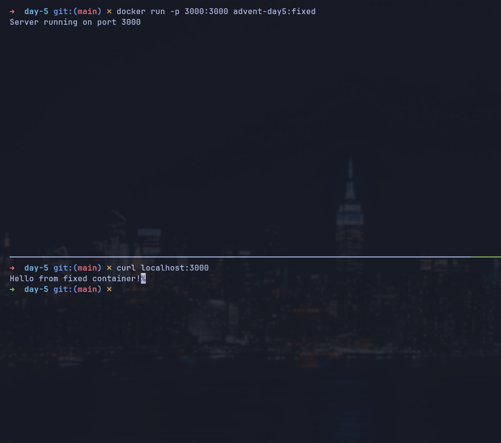

# Day 5: Debug a Broken Container

## Description
Your application container keeps crashing immediately after startup. The logs show cryptic errors, and you need to figure out what's wrong. This is a common scenario in production environments where containers fail due to configuration issues, missing dependencies, or runtime errors.

### Task
Debug and fix a broken Docker container that crashes on startup.

### Requirements:
- [x] Identify why the container is crashing
- [x] Fix the underlying issue
- [x] Verify the container runs successfully
- [x] Document the root cause

### Target
- Container starts and stays running
- Application responds to health checks
- No errors in container logs
- Root cause identified and documented

## Verification
1. Build the docker image using broken Dockerfile and verify there are some errors at building
```sh
docker build -t advent-day5:broken -f ./Dockerfile.broken .
```
2. Build the docker image using fixed Dockerfile
```sh
docker build -t advent-day5:fixed .
```
3. Run docker container and confirm it responds to requests
```sh
docker run -p 3000:3000 -d advent-day5:fixed
curl localhost:3000 # Hello from fixed container!
```

## Why Dockerfile was broken?
- `package.json` file was not being copied to the image building; so `npm install` could not download dependencies
- `CMD ["node", "server.js"]` was pointing to a non existing file (`server.js`)
- `EXPOSE 8080` was exposing a wrong port. It is not blocking but it is kinda weird to declare exposing a wrong port
- There was not `shutdown` management so; if `SIGTERM` or `SIGINT` signal was sent; docker container kept running

## Screenshots

### Failing build (broken Dockerfile)


### Successful build


### Container running and responding
